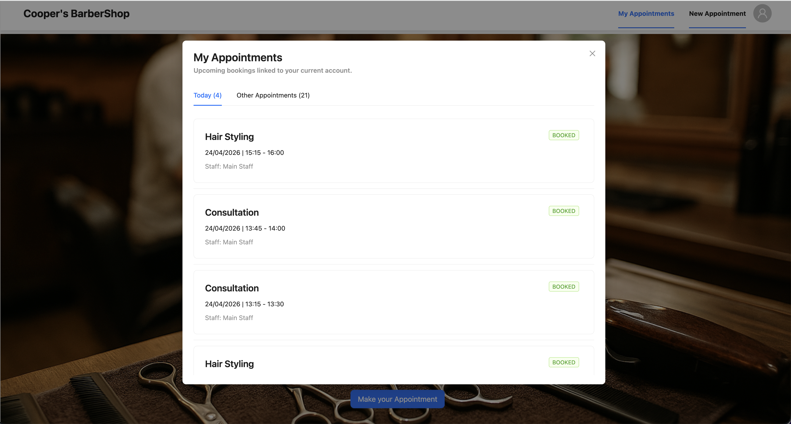

# Cooper's Barber Shop Appointment Booking Platform

Cooper's Barber Shop is a full-stack appointment booking application I built to model a practical service-business scheduling flow. The project focuses on the full customer journey: browsing barber services, authenticating, checking real-time appointment availability, booking a slot, and reviewing upcoming appointments linked to the logged-in account.

The core engineering goal is to make booking feel simple on the frontend while keeping the backend responsible for the difficult scheduling rules: staff hours, lunch breaks, service duration, buffer time, existing bookings, and double-booking prevention.

## Project Snapshot

- **Product**: Online appointment booking system for a barber shop
- **Frontend**: React, TypeScript, Vite, Ant Design, Framer Motion
- **Backend**: Node.js, NestJS, TypeScript, TypeORM
- **Database**: PostgreSQL
- **Authentication**: JWT-based login and registration
- **Scheduling model**: Single-staff availability engine with service-specific durations and mandatory buffers
- **Testing**: Jest unit tests for backend services

## Main Features

The current application experience targets the following product features:

- **Branded barber shop landing page** with service highlights and a clear appointment call to action.
- **Customer authentication modal** with login and registration tabs.
- **Protected booking flow** that requires customers to sign in before booking.
- **Service selection** from predefined barber shop services.
- **Date picker with business-day restrictions** so customers cannot select weekends or past dates.
- **Real-time slot lookup** based on selected service and appointment date.
- **Selectable appointment time slots** rendered only when the backend confirms availability.
- **Appointment creation** with conflict checking before persistence.
- **My Appointments modal** showing bookings for the current customer only.
- **Today and Other Appointments tabs** to make booking history easier to scan.
- **Booking status indicators** for confirmed appointments.
- **Responsive UI foundation** using Ant Design components.

## Product Experience

The UI shown in the current build is organized around four recruiter-visible flows:

- **Home and service discovery**: a branded Cooper's Barber Shop landing screen with the main service list and appointment call to action.
- **Authentication gate**: a login/register modal that keeps booking and account-specific appointment data behind authentication.
- **Appointment booking**: a focused booking modal for service selection, date selection, available slot selection, and booking confirmation.
- **Appointment management**: a customer appointments modal with Today and Other Appointments views, appointment details, staff display, and booking status.

## Application Screenshots

### Home and Services


### Authentication


### New Appointment Booking


### My Appointments



## Implemented User Stories

- As a customer, I can log in with predefined credentials so I can book and manage my appointments.
- As a new customer, I can register for an account and immediately use the booking flow.
- As a customer, I can view available barber services before choosing an appointment type.
- As a customer, I can select a service and date to see available time slots.
- As a customer, I can book an available appointment slot.
- As a customer, I can view my upcoming appointments for my account.
- As the system, it prevents double bookings and overlapping appointments.
- As the system, it calculates availability using staff working hours, lunch breaks, service duration, existing appointments, and buffer time.

## Architecture

```text
SA-Fullstack-Challenge-Rusira/
├── Backend/
│   ├── db/
│   │   ├── schema.sql
│   │   └── Booking-ER-Rusira.drawio.png
│   └── booking-project-backend/
│       └── src/
│           ├── appontments/
│           ├── auth/
│           ├── common/
│           ├── database/
│           ├── services/
│           ├── staff/
│           └── users/
└── Frontend/
    └── appointment-booking-frontend/
        └── src/
            ├── Models/
            ├── components/
            ├── lib/
            └── pages/
```

## Scheduling Approach

The appointment engine is implemented in the NestJS backend so availability is not trusted to the browser.

The flow is:

1. Load the selected service and its duration.
2. Resolve the default staff member and configured timezone.
3. Build the staff working window for the requested date.
4. Exclude weekends and non-working days.
5. Add unavailable intervals such as lunch break and confirmed appointments.
6. Extend each existing appointment with the staff buffer time.
7. Walk through the workday and return only slots that fit the service duration without overlapping a blocked interval.
8. Re-check the selected slot during booking before saving the appointment.

PostgreSQL also includes an exclusion constraint on booked appointment ranges to protect against overlapping records at the database layer.

## Database Design

The schema includes:

- `users` for customer and admin accounts
- `services` for predefined barber services and durations
- `staff` for the bookable staff member and buffer rules
- `staff_working_hours` for weekday working windows
- `staff_breaks` for unavailable breaks
- `appointments` for customer bookings

The database setup lives in:

```text
Backend/db/schema.sql
```

An ER diagram is included at:

```text
Backend/db/Booking-ER-Rusira.drawio.png
```

## Seed Data

### Test Accounts

| Role | Email | Password |
| --- | --- | --- |
| Customer | `customer1@sampleassist.com` | `password@123` |
| Customer | `customer2@sampleassist.com` | `password@123` |
| Seeded test account | `admin@sampleassist.com` | `admin@123` |

### Services

| Service | Duration |
| --- | ---: |
| Haircut | 30 minutes |
| Hair Styling | 45 minutes |
| Hair Coloring | 90 minutes |
| Consultation | 15 minutes |
| Deep Conditioning Treatment | 60 minutes |

### Staff Schedule

| Rule | Value |
| --- | --- |
| Staff | Main Staff |
| Timezone | Australia/Sydney |
| Working days | Monday to Friday |
| Working hours | 09:00 to 17:00 |
| Lunch break | 12:00 to 13:00 |
| Buffer after appointment | 15 minutes |

## API Overview

| Method | Endpoint | Auth | Purpose |
| --- | --- | --- | --- |
| `POST` | `/auth/login` | No | Log in and receive a JWT |
| `POST` | `/auth/register` | No | Register a customer and receive a JWT |
| `GET` | `/services` | No | List active services |
| `GET` | `/services/:id` | No | Get one service |
| `GET` | `/appointments/availability?serviceId=:id&date=YYYY-MM-DD` | Yes | Return available slots |
| `POST` | `/appointments` | Yes | Book an appointment |
| `GET` | `/appointments/all` | Yes | Return appointments for the logged-in user |

Example booking payload:

```json
{
  "serviceId": "service-uuid",
  "date": "2026-04-28",
  "slot": "09:30-09:45"
}
```

## Local Setup

### Prerequisites

- Node.js
- npm
- PostgreSQL

### 1. Create and Seed the Database

Create a PostgreSQL database that matches the backend defaults, or update the backend environment variables.

Default backend database configuration:

```text
DB_HOST=localhost
DB_PORT=5432
DB_USERNAME=booking_user
DB_PASSWORD=rusira123
DB_DATABASE=booking_db
```

Run the schema and seed script:

```bash
psql -U booking_user -d booking_db -f Backend/db/schema.sql
```

### 2. Start the Backend

```bash
cd Backend/booking-project-backend
npm install
npm run start:dev
```

The API runs on:

```text
http://localhost:3000
```

### 3. Start the Frontend

```bash
cd Frontend/appointment-booking-frontend
npm install
npm run dev
```

If needed, configure the frontend API URL:

```text
VITE_API_URL=http://localhost:3000
```

## Quality and Verification

Backend commands:

```bash
cd Backend/booking-project-backend
npm run test
npm run test:cov
npm run lint
```

Frontend commands:

```bash
cd Frontend/appointment-booking-frontend
npm run build
npm run lint
```

## Current Scale-Up Plan

The first version intentionally focuses on a clear single-staff booking workflow. I am now using the original scope exclusions as a roadmap for scaling the platform into a more complete service-business product.

Planned and in-progress enhancements:

- **Multiple staff members**: allow customers to choose a barber, then calculate availability per staff member.
- **Admin/staff dashboard**: manage services, working hours, breaks, staff profiles, and appointments.
- **Dynamic service management**: create, update, deactivate, and price services from the admin UI.
- **Appointment cancellation and rescheduling**: allow customers and staff to move bookings safely without creating conflicts.
- **Email notifications**: send booking confirmations, reminders, and cancellation updates.
- **Customer profile management**: support profile editing and saved customer details.
- **Payment-ready workflow**: introduce a payment step or deposit flow for selected services.
- **Improved observability**: add structured logging, request tracing, and production-ready error reporting.
- **Deployment hardening**: add environment-specific configuration, database migrations, and CI checks.

## Design Decisions

- I kept scheduling rules on the backend to avoid client-side trust issues.
- I used PostgreSQL range constraints as a second layer of protection against overlapping bookings.
- I kept services seeded and predefined for the first version so the booking engine remained the main focus.
- I used JWT authentication so the frontend can request account-specific appointments without storing session state on the server.
- I used Ant Design to move quickly with accessible, consistent forms, modals, tabs, date pickers, and status tags.

## Repository Goal

This repository is structured to demonstrate how I approach full-stack product development: clear user flows, practical backend rules, relational data modeling, API integration, and a frontend experience that presents complex scheduling logic in a simple booking interface.
